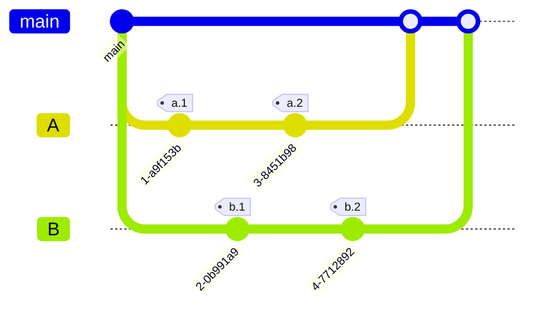

# pull-request-tut
github pull request tut. for gist
* https://github.com/hychan48/pull-request-tut
## Make branches
* for a b c
```bash
mkdir -p temp

```

## Initial commit
```bash
#
DATE=`date`
echo a $DATE > temp/a.txt
echo b $DATE > temp/b.txt
echo c $DATE > temp/c.txt

echo a $DATE > temp/a.bak.txt
echo b $DATE > temp/b.bak.txt
echo c $DATE > temp/c.bak.txt
# c.txt can be used as reference
```

* initial commit. then modify them from multiple places
## Experiment
```bash
# Init
cd ~/VSCodeProjects
git clone git@github.com:hychan48/pull-request-tut.git


git branch vscode;git checkout vscode;git push -u origin vscode
echo a `date` > temp/a.txt
git commit temp/a.txt -m "VSCodeProjects" -m "experiment vscode"

# Simutanously modify from different place:
cd ~/temp
git clone git@github.com:hychan48/pull-request-tut.git

# pull request, and see the git diff
```
### Highlevel
* git clone


## Vscode
```bash
git status
```

* remember to check LF/CRLF
* add .workspace / git config later

# Environment
1. ~/VScodeProjects/pull-request-tut
2. ~/vsCodeProjects/pull-request-tut
  * cygwin

# Githuhb api
* for validating...?

# .env

# Mermaid Git Graph



# git exp
```bash
git status
git branch --show-current
git branch --list
```