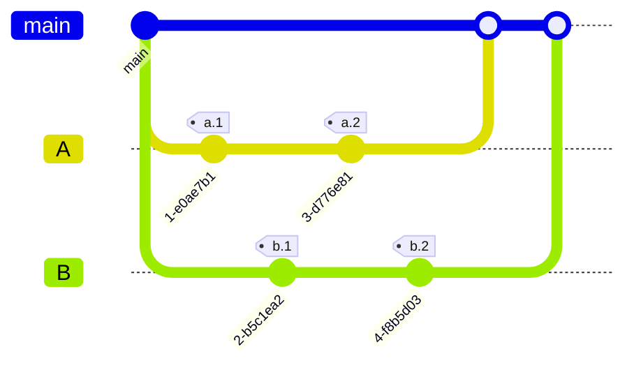

# pull-request-tut
github pull request tut. for gist
* https://github.com/hychan48/pull-request-tut
## Make branches
* for a b c
```bash
mkdir -p temp

```

## Initial commit
```bash
#
DATE=`date`
echo a $DATE > temp/a.txt
echo b $DATE > temp/b.txt
echo b $DATE > temp/ab.txt

# echo c $DATE > temp/c.txt
# needed? .bak?
echo a $DATE > temp/a.bak.txt
echo b $DATE > temp/b.bak.txt

echo c $DATE > temp/ab.bak.txt
echo c $DATE > temp/c.bak.txt
# c.txt can be used as reference
```

* initial commit. then modify them from multiple places
## Experiment
```bash
# Init
cd ~/VSCodeProjects
git clone git@github.com:hychan48/pull-request-tut.git


git branch vscode;git checkout vscode;git push -u origin vscode
echo a `date` > temp/a.txt
git commit temp/a.txt -m "VSCodeProjects" -m "experiment vscode"

# Simutanously modify from different place:
cd ~/temp
git clone git@github.com:hychan48/pull-request-tut.git

# pull request, and see the git diff
```
### Highlevel
* git clone


## Vscode
```bash
git status
```

* remember to check LF/CRLF
* add .workspace / git config later

# Environment
1. ~/VScodeProjects/pull-request-tut
2. ~/vsCodeProjects/pull-request-tut
  * cygwin

# Githuhb api
* for validating...?

# .env

# Mermaid Git Graph
* main can be 'c' for now? or just use main



# git exp
* https://github.com/hychan48/pull-request-tut/branches
* maybe enable auto-merge?

```bash
git status
git branch --show-current
git branch --list
git branch --list -r

git log main..vsCode
git diff main..vsCode # generates a file

git push --set-upstream origin jc-vscode
git push --set-upstream origin a

git fetch origin
git fetch origin --prune
git fetch origin --prune --dry-run


# Create branch and push to github
git branch -f a
git push --set-upstream origin a
## delete
git push origin --delete a
git branch -D a

# misc:
git branch -D -r origin/a
git branch -d -r a
git branch -D -r a
git branch -d -r origin/a
git branch -D -r origin/a
git push origin

```
## Revision Compare
```bash
# perfect:
git rev-list --left-right --count main...vsCode
# 0 5
git rev-list --left-right --count a...b
git rev-list --left-right --count b...a

```


# Cache directory / copy
```bash
# to cache
mkdir -p .cache/
rsync -lptgoD -u --itemize-changes README.md .cache/README.cache.md # this cmd
rsync -lptgoD -u --itemize-changes index.sh .cache/index.cache.sh #
diff -q README.md .cache/README.cache.md #
diff -q index.sh .cache/index.cache.sh #
echo $? # 0 if no diff

# rsync -lptgoD -uv README.md .cache/README.cache.md 
# rsync -lptgoD -uvP --itemize-changes README.md .cache/README.cache.md 
# will show >f.st....
echo $? #
# rsync -a index.sh .cache/index.cache.sh
# diff


# from cache?
```